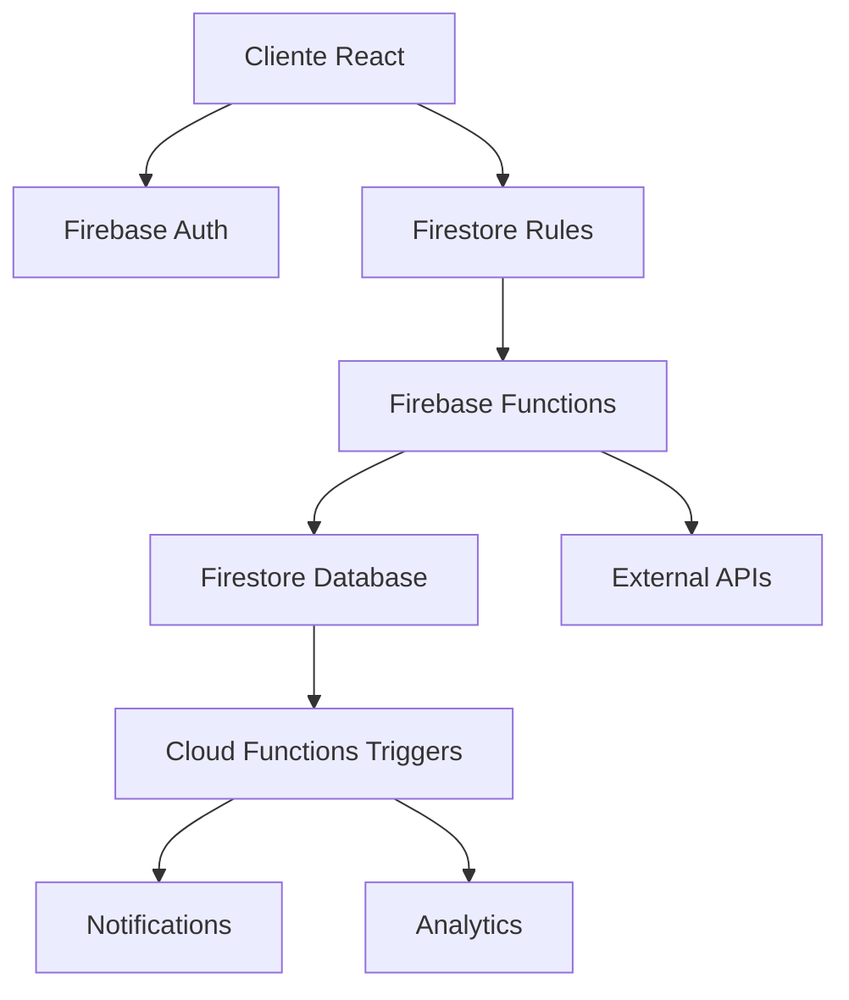

# Curva Mestra - Sistema de Gestão de Estoque Rennova

Sistema SaaS multi-tenant para gestão completa de estoque de produtos de harmonização facial da marca Rennova. O sistema oferece controle de inventário, gestão de lotes, rastreabilidade de produtos e relatórios analíticos para clínicas de estética.

## 🚀 Funcionalidades Principais

- **Gestão Multi-Tenant**: Isolamento completo de dados por clínica
- **Controle de Estoque**: Entrada, saída e transferência de produtos
- **Gestão de Lotes**: Rastreamento por lote com validade e fornecedor
- **Relatórios Analíticos**: Dashboards e relatórios de consumo
- **Sistema de Aprovação**: Workflow para aprovação de novos produtos
- **Auditoria Completa**: Log de todas as operações do sistema
- **Notificações**: Alertas de estoque baixo e produtos vencendo

## 📁 Estrutura do Projeto

```
curva-mestra/
├── functions/              # Firebase Functions (API Backend)
│   ├── src/               # Código fonte das funções
│   ├── lib/               # Build das funções
│   └── package.json       # Dependências do backend
├── client/                # Aplicação React para Clínicas
│   ├── src/               # Código fonte do cliente
│   ├── public/            # Assets públicos
│   └── build/             # Build de produção
├── admin/                 # Painel Administrativo React
│   ├── src/               # Código fonte do admin
│   ├── public/            # Assets públicos
│   └── build/             # Build de produção
├── docs/                  # Documentação do projeto
├── scripts/               # Scripts de deploy e automação
├── firebase.json          # Configuração do Firebase
├── firestore.rules        # Regras de segurança do Firestore
├── firestore.indexes.json # Índices do Firestore
├── database.rules.json    # Regras do Realtime Database
└── storage.rules          # Regras do Firebase Storage
```

## 🛠️ Tecnologias Utilizadas

### Backend
- **Firebase Functions**: Serverless backend com Node.js
- **Express.js**: Framework web para APIs REST
- **TypeScript**: Tipagem estática para JavaScript
- **Firebase Admin SDK**: Integração com serviços Firebase

### Frontend
- **React 18**: Biblioteca para interfaces de usuário
- **Material-UI (MUI)**: Componentes de design system
- **TypeScript**: Desenvolvimento type-safe
- **React Router**: Roteamento client-side
- **React Query**: Gerenciamento de estado servidor

### Database & Storage
- **Firestore**: Banco NoSQL para dados principais
- **Realtime Database**: Dados em tempo real (notificações)
- **Firebase Storage**: Armazenamento de arquivos
- **Firebase Authentication**: Sistema de autenticação

### DevOps & Deploy
- **Firebase Hosting**: Hospedagem de aplicações web
- **Firebase CLI**: Ferramentas de desenvolvimento
- **GitHub Actions**: CI/CD automatizado
- **ESLint & Prettier**: Qualidade de código

## ⚙️ Configuração do Ambiente

### Pré-requisitos

- **Node.js** 18+ ([Download](https://nodejs.org/))
- **Firebase CLI** (`npm install -g firebase-tools`)
- **Git** ([Download](https://git-scm.com/))
- **Conta Firebase** com projeto configurado

### 🔧 Instalação

1. **Clone o repositório:**
```bash
git clone <repository-url>
cd curva-mestra
```

2. **Instale as dependências:**
```bash
# Dependências raiz
npm install

# Backend (Functions)
cd functions && npm install && cd ..

# Cliente (Clínicas)
cd client && npm install && cd ..

# Admin (Painel Administrativo)
cd admin && npm install && cd ..
```

3. **Configure as variáveis de ambiente:**
```bash
# Cliente
cp client/.env.example client/.env

# Admin
cp admin/.env.example admin/.env
```

4. **Configure o Firebase:**
```bash
# Login no Firebase
firebase login

# Selecione o projeto
firebase use --add

# Configure os emuladores (opcional)
firebase init emulators
```

5. **Configure as variáveis no arquivo .env:**
```bash
# client/.env e admin/.env
REACT_APP_FIREBASE_API_KEY=your_api_key
REACT_APP_FIREBASE_AUTH_DOMAIN=your_project.firebaseapp.com
REACT_APP_FIREBASE_PROJECT_ID=your_project_id
REACT_APP_FIREBASE_STORAGE_BUCKET=your_project.appspot.com
REACT_APP_FIREBASE_MESSAGING_SENDER_ID=your_sender_id
REACT_APP_FIREBASE_APP_ID=your_app_id
```

## 🚀 Desenvolvimento

### Iniciar Ambiente de Desenvolvimento

**Todos os serviços simultaneamente:**
```bash
npm run dev
```

**Serviços individuais:**
```bash
# Backend (Firebase Functions)
npm run dev:functions

# Cliente (Aplicação das Clínicas)
npm run dev:client

# Admin (Painel Administrativo)
npm run dev:admin

# Emuladores Firebase
npm run emulators
```

### URLs de Desenvolvimento

- **Cliente (Clínicas)**: http://localhost:3000
- **Admin (Painel)**: http://localhost:3001
- **Functions (API)**: http://localhost:5001
- **Emuladores UI**: http://localhost:4000

### 🔧 Emuladores Firebase

|---------|-----|-------|
| **Auth** | http://localhost:9099 | 9099 |
| **Firestore** | http://localhost:8080 | 8080 |
| **Realtime Database** | http://localhost:9000 | 9000 |
| **Functions** | http://localhost:5001 | 5001 |
| **Storage** | http://localhost:9199 | 9199 |
| **UI dos Emuladores** | http://localhost:4000 | 4000 |

**Comandos úteis:**
```bash
# Iniciar emuladores
firebase emulators:start

# Iniciar com dados de seed
firebase emulators:start --import=./emulator-data

# Exportar dados dos emuladores
firebase emulators:export ./emulator-data
```

## 📦 Build e Deploy

### Build Local
```bash
# Build de todos os projetos
npm run build

# Build individual
npm run build:functions
npm run build:client
npm run build:admin
```

### Deploy para Produção
```bash
# Deploy completo
npm run deploy

# Deploy individual
firebase deploy --only functions
firebase deploy --only hosting:client
firebase deploy --only hosting:admin
firebase deploy --only firestore:rules
firebase deploy --only storage:rules
```

### Deploy por Ambiente
```bash
# Staging
firebase use staging && npm run deploy

# Produção
firebase use production && npm run deploy
```

## 🧪 Testes

### Executar Testes
```bash
# Todos os testes
npm test

# Testes por módulo
npm run test:functions
npm run test:client
npm run test:admin

# Testes com coverage
npm run test:coverage

# Testes em modo watch
npm run test:watch
```

### Tipos de Teste
- **Unit Tests**: Testes unitários de componentes e funções
- **Integration Tests**: Testes de integração com Firebase
- **E2E Tests**: Testes end-to-end com Cypress
- **API Tests**: Testes das Firebase Functions

## 🏗️ Arquitetura do Sistema

### Multi-Tenancy (SaaS)

O sistema implementa **multi-tenancy lógico** com isolamento completo de dados:

```
┌─────────────────┐    ┌─────────────────┐    ┌─────────────────┐
│   Clínica A     │    │   Clínica B     │    │   Clínica C     │
│  (tenant_id: A) │    │  (tenant_id: B) │    │  (tenant_id: C) │
└─────────────────┘    └─────────────────┘    └─────────────────┘
         │                       │                       │
         └───────────────────────┼───────────────────────┘
                                 │
                    ┌─────────────────────┐
                    │  Firestore Database │
                    │   (Shared Instance) │
                    └─────────────────────┘
```

**Características:**
- Cada clínica é um tenant isolado
- Dados filtrados por `clinic_id` em todas as queries
- Regras de segurança garantem isolamento total
- Sistema admin tem acesso global para gestão

### Roles e Permissões

| Role | Descrição | Permissões |
|------|-----------|------------|
| **system_admin** | Administrador do sistema | Acesso global, aprovação de produtos, gestão de clínicas |
| **clinic_admin** | Administrador da clínica | Gestão completa da clínica, usuários e configurações |
| **clinic_manager** | Gerente da clínica | Operações de estoque, relatórios, sem gestão de usuários |
| **clinic_user** | Usuário operacional | Consulta de estoque, movimentações básicas |

### Segurança e Compliance

- **Autenticação**: Firebase Authentication com MFA opcional
- **Autorização**: Sistema baseado em roles e permissões granulares
- **Auditoria**: Log completo de todas as operações
- **Criptografia**: Dados sensíveis criptografados em repouso
- **Backup**: Backup automático diário do Firestore
- **Monitoramento**: Alertas de segurança e performance

### Fluxo de Dados



## 🌐 Domínios e Ambientes

### Produção
- **Cliente**: https://curvamestra.com.br
- **Admin**: https://admin.curvamestra.com.br
- **API**: https://api.curvamestra.com.br

### Staging
- **Cliente**: https://staging-curva-mestra.web.app
- **Admin**: https://staging-admin-curva-mestra.web.app

### Desenvolvimento
- **Cliente**: http://localhost:3000
- **Admin**: http://localhost:3001

## 📊 Monitoramento e Analytics

### Ferramentas de Monitoramento
- **Firebase Performance**: Monitoramento de performance
- **Firebase Crashlytics**: Relatórios de crash
- **Google Analytics**: Analytics de uso
- **Firebase Functions Logs**: Logs centralizados

### Métricas Importantes
- Tempo de resposta das APIs
- Taxa de erro das operações
- Uso de recursos (CPU, memória)
- Satisfação do usuário (NPS)

## 🤝 Contribuição

### Workflow de Desenvolvimento

1. **Fork** o projeto
2. **Clone** seu fork localmente
3. **Crie** uma branch para sua feature:
   ```bash
   git checkout -b feature/nova-funcionalidade
   ```
4. **Desenvolva** seguindo os padrões do projeto
5. **Teste** suas alterações
6. **Commit** suas mudanças:
   ```bash
   git commit -m "feat: adiciona nova funcionalidade"
   ```
7. **Push** para sua branch:
   ```bash
   git push origin feature/nova-funcionalidade
   ```
8. **Abra** um Pull Request

### Padrões de Código

- **Commits**: Seguir [Conventional Commits](https://www.conventionalcommits.org/)
- **Code Style**: ESLint + Prettier configurados
- **Testes**: Cobertura mínima de 80%
- **Documentação**: Documentar APIs e componentes complexos

### Code Review

- Pelo menos 1 aprovação necessária
- Todos os testes devem passar
- Cobertura de código mantida
- Documentação atualizada

## 📄 Licença

Este projeto é **propriedade de Guilherme Stanke Scandelari** e está sob **licença proprietária**.


---

## 📞 Suporte

Para suporte técnico ou dúvidas sobre o sistema:

- **Email**: scandelari.guilherme@hotmail.com
- **Documentação**: [docs/](./docs/)
- **Issues**: Use o sistema de issues do GitHub para reportar bugs

---

**Desenvolvido com ❤️ por Guilherme S. Scandelari**
